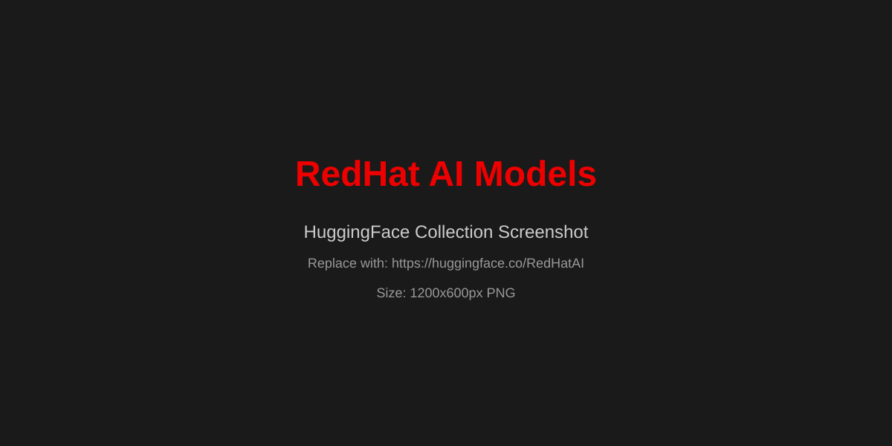
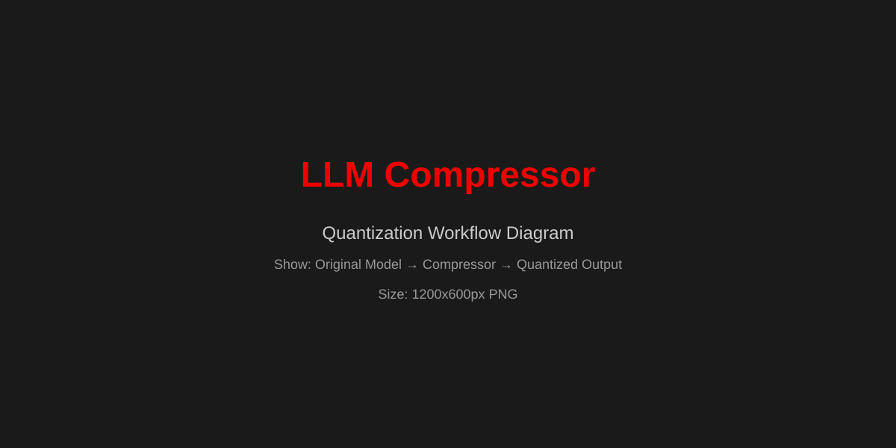
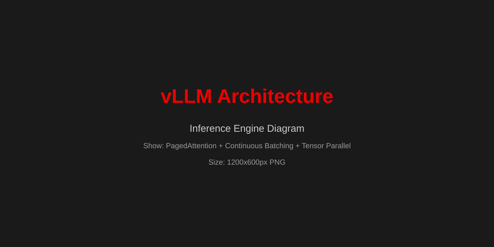

# Boston Tech Week 2026
## LLM Quantization Workshop

Welcome to the hands-on workshop on LLM quantization and performance benchmarking!

## Quick Links

### For Participants
- **[Workshop Notebook](https://colab.research.google.com/github/soyr-redhat/boston-tech-week-26-llm-compressor/blob/main/workshop_notebook.ipynb)** - Interactive benchmarking (works on all platforms)
- **[Quick Start Guide](quick-start)** - Command-line alternative
- **[Workshop Guide](workshop-guide)** - Full 60-minute workshop agenda
- **[Demo UI](https://comparison-ui.apps.ocp.ntdrq.sandbox503.opentlc.com)** - Live model comparison

### For Instructors
- **[Instructor Walkthrough](instructor-guide)** - Step-by-step teaching guide
- **[Cluster Status](cluster-status)** - Infrastructure and management

## Workshop Overview

**Duration:** 60 minutes  
**Format:** Instructor demo (30 min) + Hands-on benchmarking (30 min)

### Part 1: Understanding Quantization (30 min)
- What is quantization and why does it matter?
- Live side-by-side comparison of FP16 vs INT4 models
- Performance metrics and quality trade-offs

### Part 2: Hands-On Benchmarking (30 min)
- Open the workshop notebook in your browser (Google Colab or local Jupyter)
- Run benchmarks against production endpoints
- Compare throughput, latency, and quality with interactive charts

## What You'll Learn

1. **Model Quantization Fundamentals**
   - FP16, INT8, INT4, FP8 precision formats
   - Memory and compute trade-offs
   - When to quantize (and when not to)

2. **Performance Benchmarking**
   - Using guidellm to load test LLM APIs
   - Interpreting metrics: throughput, latency, P95/P99
   - Real-world production considerations

3. **Hands-On Experience**
   - Deploy quantized models with vLLM
   - Measure actual speedup (1.5-2x typical)
   - Understand quality vs performance balance

## Prerequisites

- **Laptop** with internet access
- **Web browser** (Chrome, Firefox, Safari, Edge)
- No GPU, Python, or cluster access required!

## Setup (Before Workshop)

### Option 1: Google Colab (Zero Setup - Recommended)

Just click the link during the workshop - no installation needed!

[](https://colab.research.google.com/github/soyr-redhat/boston-tech-week-26-llm-compressor/blob/main/workshop_notebook.ipynb)

### Option 2: Local Jupyter

If you prefer to run locally:

```bash
# Install Jupyter
pip install notebook

# Download the workshop notebook
curl -O https://raw.githubusercontent.com/soyr-redhat/boston-tech-week-26-llm-compressor/main/workshop_notebook.ipynb

# Start Jupyter
jupyter notebook workshop_notebook.ipynb
```

That's it! The notebook will install dependencies automatically, and the vLLM models are already running in the cloud.

**Having issues?** See the [troubleshooting section](workshop-guide#troubleshooting) in the full workshop guide.

## Live Infrastructure

### Model Endpoints (Public)
- **Original Model (FP16):** https://vllm-original.apps.ocp.ntdrq.sandbox503.opentlc.com/v1
- **Quantized Model (INT4):** https://vllm-quantized.apps.ocp.ntdrq.sandbox503.opentlc.com/v1

### Comparison UI (Demo)
- **URL:** https://comparison-ui.apps.ocp.ntdrq.sandbox503.opentlc.com
- Side-by-side streaming responses
- Real-time metrics
- Everforest theme

## Architecture

```
┌─────────────────────────────────────────────────────────┐
│                  Your Laptop (50 users)                 │
│                                                          │
│  $ pip install guidellm                                 │
│  $ guidellm --target <endpoint> ...                     │
│                                                          │
└────────────┬────────────────────────────┬───────────────┘
             │                            │
             │ HTTPS                      │ HTTPS
             │                            │
       ┌─────▼──────┐             ┌──────▼─────┐
       │  Original  │             │ Quantized  │
       │ Qwen 7B    │             │ Qwen 9B    │
       │ FP16       │             │ INT4       │
       │ 2× L4 GPU  │             │ 2× L4 GPU  │
       └────────────┘             └────────────┘
              OpenShift Cluster
```

## Key Technologies

### RedHat AI Quantized Models



RedHat AI provides production-ready quantized models on HuggingFace, optimized for enterprise deployment. These models are pre-quantized using state-of-the-art techniques and thoroughly tested for quality retention.

**Why use RedHat AI models?**

- Pre-quantized and ready to deploy
- Enterprise support and validation
- Optimized for vLLM and OpenShift
- Multiple quantization levels (INT4, INT8, FP8)
- Consistent quality across model families

**Explore the collection:** [https://huggingface.co/RedHatAI](https://huggingface.co/RedHatAI)

In this workshop, we use the `RedHatAI/Qwen3.5-9B-quantized.w4a16` model - a 9B parameter model quantized to 4-bit weights with 16-bit activations, delivering 2x speedup with minimal quality loss.

### LLM Compressor



LLM Compressor is an open-source toolkit for applying various compression techniques to large language models, including quantization, pruning, and distillation.

**Key features:**

- **Multiple quantization formats:** INT4, INT8, FP8
- **Advanced techniques:** GPTQ, AWQ, SmoothQuant
- **One-line API:** Simple Python interface for quantization
- **vLLM integration:** Direct export to vLLM-compatible formats
- **Quality metrics:** Built-in evaluation to measure accuracy impact

**Example usage:**

```python
from llmcompressor import quantize

# Quantize a model to INT4
quantize(
    model="meta-llama/Llama-2-7b-hf",
    dataset="wikitext",
    output_dir="./quantized_model",
    recipe="int4"
)
```

**Learn more:** [github.com/vllm-project/llm-compressor](https://github.com/vllm-project/llm-compressor)

### vLLM



vLLM is a high-throughput and memory-efficient inference engine for large language models, designed for production deployments.

**Why vLLM?**

- **PagedAttention:** Efficient KV cache management
- **Continuous batching:** Maximizes GPU utilization
- **Tensor parallelism:** Multi-GPU support
- **Quantization support:** INT4, INT8, FP8, AWQ, GPTQ
- **OpenAI-compatible API:** Easy integration
- **Streaming responses:** Real-time token generation

**Performance benefits:**

- 2-4x higher throughput than HuggingFace Transformers
- Up to 24x higher throughput than text-generation-inference
- Efficient memory usage with PagedAttention
- Optimized CUDA kernels for various quantization formats

In this workshop, both model endpoints are served with vLLM in OpenShift, demonstrating enterprise-scale deployment patterns.

**Documentation:** [docs.vllm.ai](https://docs.vllm.ai/)

## Resources

- **vLLM Documentation:** [docs.vllm.ai](https://docs.vllm.ai/)
- **guidellm GitHub:** [neuralmagic/guidellm](https://github.com/neuralmagic/guidellm)
- **LLM Compressor:** [vllm-project/llm-compressor](https://github.com/vllm-project/llm-compressor)
- **RedHat AI Models:** [huggingface.co/RedHatAI](https://huggingface.co/RedHatAI)

## After the Workshop

- Quantize your own models with `llm-compressor`
- Deploy in production with vLLM
- Experiment with INT8, FP8, structured pruning
- Join the discussion in Boston Tech Week Slack

## Questions?

- Raise your hand during the workshop
- Ask in Boston Tech Week Slack
- Email: workshop@example.com

