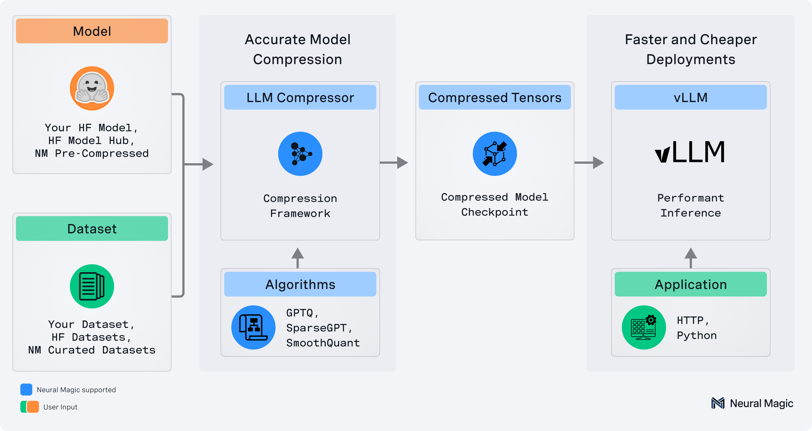
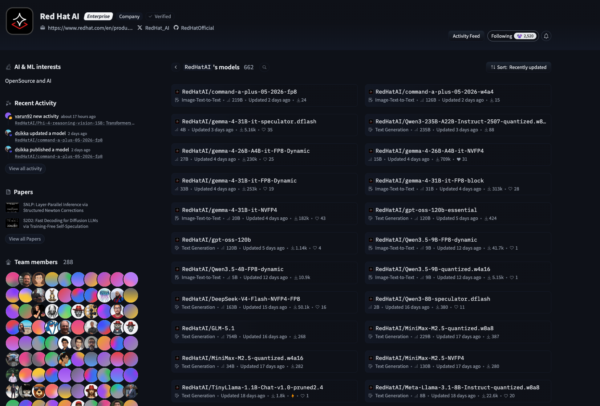

# Boston Tech Week 2026
## LLM Quantization Workshop

**Duration:** 60 minutes  
**Hands-On:** Interactive notebook in your browser

---

## For Participants

### Getting Started

1. **Visit the workshop landing page:**  
   <a href="https://red.ht/build-and-brew-26-workshop-provision" target="_blank">https://red.ht/build-and-brew-26-workshop-provision</a>

2. **Click "Get My Workspace"** to receive your personal JupyterLab URL

3. **Open `workshop_notebook.ipynb`** and follow the instructions

That's it! Everything runs in your browser - no installation required.

### What You'll Do

**Part 1: Understanding Quantization (30 min)**
- Watch live demo comparing FP16 vs INT4 models
- Learn about precision formats and performance trade-offs
- See real-time metrics in the comparison UI

**Part 2: Hands-On Benchmarking (30 min)**
- Benchmark both models using guidellm
- Compare throughput and latency
- Visualize results with interactive charts

### Demo UI

Try inferencing with the dense and quantized model in real time!:  
<a href="https://red.ht/build-and-brew-inference" target="_blank">https://red.ht/build-and-brew-inference</a>

---

## Technical Details

- **[Infrastructure Status](cluster-status.md)** - Resource usage and operations
- **<a href="https://github.com/soyr-redhat/boston-tech-week-26-llm-compressor" target="_blank">GitHub Repository</a>** - Source code

---

## What You'll Learn

### Model Quantization Fundamentals
- FP16, INT8, INT4 precision formats
- Memory and compute trade-offs
- When to quantize (and when not to)

*LLM Compressor: Transform models with quantization, pruning, and distillation*

### Performance Benchmarking
- Using guidellm to load test LLM APIs
- Interpreting metrics: throughput, latency, P95/P99
- Real-world production considerations

### Deployment at Scale
- vLLM for high-throughput inference
- Tensor parallelism across GPUs
- OpenShift/Kubernetes deployment patterns

---

## Models Used

| Model | Precision | Size | GPUs |
|-------|-----------|------|------|
| Qwen/Qwen2.5-7B-Instruct | FP16 | ~14GB | 2x L4 |
| RedHatAI/Qwen3.5-9B-quantized.w4a16 | INT4 | ~5GB | 2x L4 |

**Expected Performance:**
- 1.5-2x throughput improvement
- 30-40% latency reduction
- 50-75% memory savings
- <2% quality degradation

---

## Resources

- **vLLM:** <a href="https://docs.vllm.ai/" target="_blank">docs.vllm.ai</a>
- **guidellm:** <a href="https://github.com/vllm-project/guidellm" target="_blank">github.com/vllm-project/guidellm</a>
- **LLM Compressor:** <a href="https://github.com/vllm-project/llm-compressor" target="_blank">github.com/vllm-project/llm-compressor</a>
- **RedHat AI Models:** <a href="https://huggingface.co/RedHatAI" target="_blank">huggingface.co/RedHatAI</a>

*Browse enterprise-ready quantized models at huggingface.co/RedHatAI*

---

**Questions?** Ask during the workshop or open an issue on GitHub!
